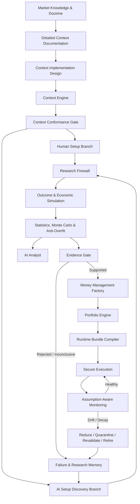

# Alpha Lab Master Architecture

> [!abstract] Canonical purpose
> This vault is the architectural layer above all individual strategy, context, training, validation, execution and monitoring engines. It defines how a human market viewpoint becomes a versioned context engine, how that context is exploited by manual and AI-generated setups, how evidence is produced without contamination, how supported alpha is converted into capital, and how live assumptions are continuously monitored.

## The Complete System



## Core Architectural Idea

The platform permanently separates:

```text
Market meaning
≠ Context occurrence
≠ Setup / exploitation
≠ Statistical evidence
≠ Capital allocation
≠ Runtime decision
≠ Broker execution
```

The long-term goal is that **only the context-specific meaning and extraction logic remain materially unique**. Everything else becomes shared platform capability.

## Primary Navigation

- [[00_MASTER_ARCHITECTURE/01_Canonical_End_To_End_Architecture|Canonical End-to-End Architecture]]
- [[00_MASTER_ARCHITECTURE/02_Knowledge_To_Context_Architecture|Knowledge-to-Context Architecture]]
- [[00_MASTER_ARCHITECTURE/03_Context_Factory_Architecture|Context Factory Architecture]]
- [[00_MASTER_ARCHITECTURE/04_Two_Branch_Setup_Architecture|Two-Branch Setup Architecture]]
- [[00_MASTER_ARCHITECTURE/05_AI_Setup_Discovery_Architecture|AI Setup Discovery Architecture]]
- [[00_MASTER_ARCHITECTURE/06_Research_Firewall_And_Evidence|Research Firewall and Evidence]]
- [[00_MASTER_ARCHITECTURE/07_Statistics_Monte_Carlo_And_AI_Analyst|Statistics, Monte Carlo and AI Analyst]]
- [[00_MASTER_ARCHITECTURE/08_Capital_And_Portfolio_Architecture|Capital and Portfolio Architecture]]
- [[00_MASTER_ARCHITECTURE/09_Runtime_Security_And_Execution|Runtime, Security and Execution]]
- [[00_MASTER_ARCHITECTURE/10_Assumption_Aware_Monitoring|Assumption-Aware Monitoring]]
- [[00_MASTER_ARCHITECTURE/11_Compounding_Speed_And_Scalability|Compounding Speed and Scalability]]
- [[00_MASTER_ARCHITECTURE/12_Authority_Lineage_And_Artifact_Chain|Authority, Lineage and Artifact Chain]]
- [[00_MASTER_ARCHITECTURE/13_Implementation_Program|Implementation Program]]
- [[00_MASTER_ARCHITECTURE/14_Architectural_Risks_And_Controls|Architectural Risks and Controls]]
- [[00_MASTER_ARCHITECTURE/15_Persian_Master_Overview|Persian Master Overview]]
- [[00_MASTER_ARCHITECTURE/16_Source_Library_Map|Source Library Map]]

## Canonical Source Libraries

This master layer is supported by four detailed libraries already included inside the vault:

- [[strategy_factory/00_start_here/00_STRATEGY_FACTORY_MOC|Strategy Factory]]
- [[strategy_factory_v2/00_start_here/00_STRATEGY_FACTORY_V2_MOC|Strategy Factory V2]]
- [[strategy_factory_universal_context_exploitation_engine/00_UNIVERSAL_CONTEXT_EXPLOITATION_ENGINE_MOC|Universal Context Exploitation Engine]]
- [[ai_algorithm_engineering_os/00_START_HERE/00_Home|AI Algorithm Engineering OS]]

## Final Product

The final product is not one profitable strategy. It is a **closed research-to-capital operating system** in which every context, setup, failed trial, statistical result, capital decision, live fill and drift event becomes reusable knowledge.
