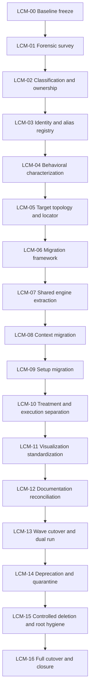

# Program Architecture and Critical Path

## Critical path

The critical path is not code movement. It is:

`owner resolution → behavioral capture → canonical specification → parity proof → cutover approval`.

Folder changes can proceed only after a file or domain family has crossed the required state boundary. The first irreversible action is deletion, therefore deletion is deliberately near the end of the program.

## Parallelizable work

The following can run in parallel after LCM-02:

- source characterization for independent domain families;
- documentation authority classification;
- root release-metadata cataloging;
- compatibility-adapter scaffolding;
- shared-engine candidate analysis.

The following must remain serialized:

- canonical identity assignment before package creation;
- behavior characterization before semantic refactor;
- parity before cutover;
- cutover before quarantine;
- quarantine before deletion.

## Program release model

Every phase is delivered as a root-relative patch. Move-only, characterization, refactor, cutover, quarantine and deletion changes are never combined in one commit.
