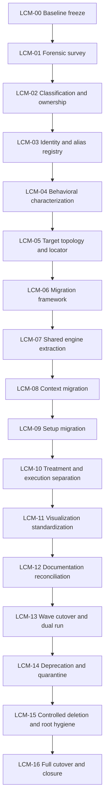

# Program Architecture and Critical Path

## Master-phase architecture

## Refined implementation train

## Critical path

The critical path is not file movement. It is:

`owner resolution → evidence capture → canonical contract → deterministic implementation → parity proof → reversible cutover → quarantine maturity → deletion proof → closure evidence`.

The balanced partition protects this path by separating concerns that have different failure and rollback semantics. Context portfolio selection is separated from pilot implementation; Treatment extraction is separated from execution safety proof; dual-run evidence is separated from consumer switching; deletion proof is separated from repository reorganization and destructive deletion.

## Serialization rules

The following transitions are strictly serialized:

- identity before package creation;
- characterization before semantic refactor;
- Context packages before Setup packages;
- Setup packages before Treatment extraction;
- disabled execution boundary before dry parity;
- visual contracts before visual cutover;
- documentation authority before relocation;
- dual-run evidence before consumer switch;
- cutover rollback proof before deprecation;
- deprecation before quarantine;
- quarantine maturity before deletion eligibility;
- deletion proof before reorganization and revalidation;
- full audit before closure decision.

## Parallel work allowed inside a subphase

Independent domain families may be analyzed in parallel only when they use separate packet identities, source digests, owners and acceptance records. A parallel task cannot publish directly to the next subphase; its outputs must be consolidated through the current subphase gate.

## Release model

Every subphase is a root-relative atomic patch. The master phase closes only after all of its subphase patches are accepted. See [[PHASE_PARTITION_AND_PATCH_GRANULARITY_STANDARD]] and [[SUBPHASE_HANDOFF_AND_CHECKPOINT_STANDARD]].
