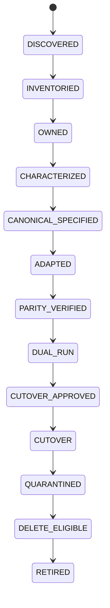

# Migration State Machine

```mermaid
stateDiagram-v2
    [*] --> DISCOVERED
    DISCOVERED --> INVENTORIED
    INVENTORIED --> OWNED
    OWNED --> CHARACTERIZED
    CHARACTERIZED --> CANONICAL_SPECIFIED
    CANONICAL_SPECIFIED --> ADAPTED
    ADAPTED --> PARITY_VERIFIED
    PARITY_VERIFIED --> DUAL_RUN
    DUAL_RUN --> CUTOVER_APPROVED
    CUTOVER_APPROVED --> CUTOVER
    CUTOVER --> QUARANTINED
    QUARANTINED --> DELETE_ELIGIBLE
    DELETE_ELIGIBLE --> RETIRED
```

Every transition requires an evidence bundle. `QUARANTINED` is reversible. `RETIRED` is reached only after the deletion ledger or a permanent archive decision.
