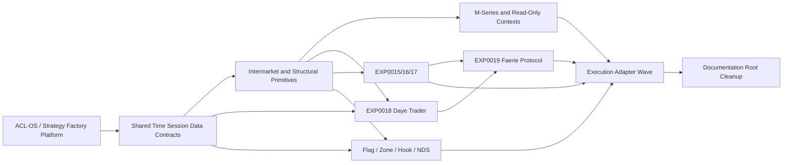

# Family Dependency Graph

## Dependency decisions

- Shared time/session/known-time primitives precede all session-based families.
- Intermarket reference and divergence primitives precede EXP0017, EXP0018 and EXP0019 consolidation.
- EXP0019 depends on stable shared cores and must not fork them during migration.
- Flag/NDS/Hook/Zone requires its own sub-wave graph because Zone, Hook validity, NDS entitlement, treatment and broker request layers are distinct.
- Execution adapters are last because they consume canonical Context, Setup and Treatment outputs.
- Documentation/root cleanup waits for all active successor paths.
