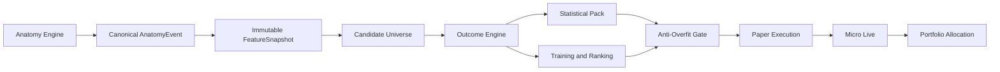

# Strategy Factory — Master Map of Content

The Strategy Factory is the canonical engine that converts any approved market anatomy into reproducible statistics, candidate setups, entry/stop/exit policies, machine-learning experiments, paper execution, live execution, and monitored capital allocation. The anatomy remains strategy-specific; everything after the canonical event boundary is shared.

## One factory, many anatomies

The platform exists to prevent every strategy family from rebuilding its own research, backtest, model, and execution stack. NDS, temporal divergence, Daye, structural nodes, ICT, astro, or any future ontology should only implement an adapter and any genuinely unique policies. Shared components must remain domain-neutral.

## Canonical reading order

1. [[01_MISSION_AND_NON_GOALS]]
2. [[02_EXECUTIVE_SYSTEM_ARCHITECTURE]]
3. [[03_STRATEGY_LIFECYCLE_AND_STATE_MACHINE]]
4. [[08_ANATOMY_ADAPTER_CONTRACT]]
5. [[09_KNOWN_TIME_AND_CAUSALITY_CONTRACT]]
6. [[14_CANDIDATE_UNIVERSE_ENGINE]]
7. [[21_OUTCOME_ENGINE_AND_PATH_ACCOUNTING]]
8. [[28_PURGED_WALK_FORWARD_VALIDATION]]
9. [[31_MULTIPLE_TESTING_AND_FALSE_DISCOVERY_CONTROL]]
10. [[40_AI_OPERATING_MODEL]]
11. [[49_PAPER_EXECUTION_ARCHITECTURE]]
12. [[50_HARD_RISK_GATE]]
13. [[58_STRATEGY_PROMOTION_AND_RETIREMENT]]
14. [[63_NEW_ANATOMY_ONBOARDING_RUNBOOK]]

## Code map

- Python core: `lab/11_strategy_factory/python/strategy_factory`
- Tests: `lab/11_strategy_factory/tests`
- Example manifests: `lab/11_strategy_factory/examples/manifests`
- MQL5 contracts: `lab/11_strategy_factory/mql5/Include/AlphaLab/StrategyFactory`
- CLI launcher: `lab/11_strategy_factory/sf.py`

The code is intentionally small enough to audit and complete enough to serve as the official base. Production extensions should add plugins, not fork the pipeline.

## Non-negotiable doctrine

- No future-derived feature may enter a decision snapshot.
- A candidate is not a trade; a model score is not execution authority.
- Every tested variant counts as a research trial.
- All official performance is measured after explicit costs.
- Train/test separation is performed at market-event-cluster level and purged by label horizon.
- Paper and live use the same decision and risk contracts.
- A strategy advances one lifecycle state at a time.
- Failure, retirement, and negative evidence are first-class outputs.

