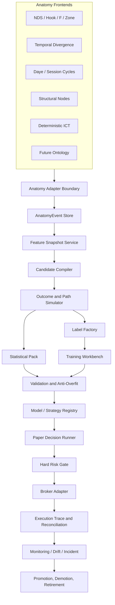

# Full Reference Architecture — Anatomy to Capital

## Purpose

This document is the full technical reference for the shared Strategy Factory. Its objective is to make the marginal cost of a new strategy extremely small after the strategy's anatomy has been formalized. The platform therefore treats a market anatomy as a frontend language and compiles it into a standard intermediate representation. All downstream research and execution services operate on that representation rather than on strategy-specific classes.

The design optimizes five properties simultaneously:

1. **Causal validity** — no event, feature, label, or decision may use information unavailable at its declared time.
2. **Maximum reuse** — common statistics, validation, training, paper, risk, and broker logic are written once.
3. **Falsifiability** — every strategy must define a null, matched baseline, kill criteria, and promotion gates.
4. **Execution parity** — research, paper, and live share candidate, intent, risk, and lifecycle semantics.
5. **Research velocity** — a new anatomy should require an adapter, manifest, optional feature providers, and fixtures rather than a new platform.

## System topology



## Service ownership

### Anatomy frontend

The frontend owns market doctrine. It may determine whether an object exists, how it is identified, its direction, lifecycle, parent references, and invalidation. It must state when the object became knowable. It does not own outcomes, model scoring, risk, or orders.

### Adapter boundary

The adapter translates anatomy-native structures into `AnatomyEvent` and `FeatureSnapshot`. The adapter must be deterministic and independently replayable. It is intentionally narrow so that a strategy cannot smuggle custom execution authority into the shared core.

### Candidate compiler

The compiler takes a canonical event and a bounded manifest of entry, stop, exit, expiry, and cost policies. It emits every declared candidate and records incompatibilities. It never selects the historical winner. Its job is exhaustive, deterministic enumeration within an approved search surface.

### Outcome engine

The outcome engine performs causal path replay. It applies bid/ask and order-type semantics, fill eligibility, expiry, stop/target ordering, time exits, position-management transitions, slippage, spread, and commission. It records no-fill cases and ambiguous bars rather than discarding them.

### Statistical and validation plane

This plane calculates the same report for every strategy, including base rates, conditional tables, distributions, cluster confidence intervals, null tests, FDR, reality check, Deflated Sharpe, PBO, fragility, cross-feed replication, and fold stability. The official unit is the market-event cluster unless a stricter unit is declared.

### Training plane

The training plane consumes only immutable snapshots and candidate descriptors. It supports trade/skip classification, expected-R regression, candidate ranking, survival, and later sequence models. Every model is trained on purged folds, uses train-only transformations, and is registered with exact artifact hashes.

### Decision and execution plane

A rule or model may choose from existing candidates or skip. It emits a `ModelDecision`; the system then creates an `ExecutionIntent`. The hard risk gate has final authority over size and exposure. The broker bridge can only receive a valid approved intent. It cannot create or reinterpret a signal.

## Deployment modes

| Mode | Purpose | Order authority | Data source |
|---|---|---:|---|
| Historical research | candidate simulation and statistics | none | stored bars/ticks |
| Replay | causal deterministic validation | none | historical stream |
| Shadow | live events and predictions | none | live feed |
| Paper | full lifecycle with virtual fills | virtual only | live quotes |
| Micro-live | execution fidelity and risk proof | bounded | broker |
| Live | approved capital deployment | bounded by risk gate | broker |

A strategy cannot jump modes. Shadow and paper are not optional when model scoring or complex lifecycle logic is introduced.

## Process isolation

Training is offline and may use substantial compute. Inference is a frozen artifact. Execution is deterministic and low latency. A training process must never modify the live model file in place. Deployment uses an atomic version switch with compatibility checks and rollback.

Recommended process boundaries:

```text
research job     -> immutable run artifacts
model packaging  -> signed model bundle
inference service/EA -> read-only model bundle
risk service/EA  -> deterministic policy state
broker bridge    -> broker-specific API only
monitoring       -> append-only trace and alerts
```

## Reusable plugin surfaces

A new anatomy may provide:

- `AnatomyAdapter`
- strategy-specific feature providers
- one or more candidate policies not present in the common library
- strategy-specific null/placebo generators
- golden replay fixtures

It may not provide:

- a private walk-forward splitter
- a private definition of net R
- a private risk gate
- a private paper broker
- a private model registry
- a private promotion process

Exceptions require an architectural decision explaining why the shared component cannot represent the required semantics.

## Standard artifact graph

```text
source_data_manifest.json
  -> events.parquet
  -> snapshots.parquet
  -> candidates.parquet
  -> outcomes.parquet
  -> model_dataset.parquet
  -> folds.parquet
  -> baseline_predictions.parquet
  -> challenger_predictions.parquet
  -> statistics.json
  -> anti_overfit.json
  -> model_card.md
  -> promotion_decision.json
  -> paper_traces.parquet
  -> live_traces.parquet
```

Each arrow is a versioned transformation. The run manifest stores producer code version, input hashes, output hashes, seed, environment, and status. If an output changes unexpectedly, the first changed artifact identifies the investigation boundary.

## Failure containment

The architecture fails closed at every boundary:

- invalid event: quarantine event
- future feature: reject snapshot
- invalid candidate geometry: reject candidate
- ambiguous path: conservative result or reject
- failed leakage audit: block training
- model schema mismatch: skip decision
- failed risk gate: no intent submission
- broker ambiguity: reconcile before retry
- state mismatch: kill switch
- drift: demote to paper or baseline

The system never converts uncertainty into permission merely to maintain uptime.

## Performance and scale

Research speed is obtained by caching immutable artifacts. Bars are ingested once. Shared context can be computed once per symbol/time. Events and candidates are partitioned by strategy and market-event cluster. Outcome simulation can be parallelized by cluster because candidates inside a cluster are kept together for evaluation. Feature and model jobs read materialized tables rather than repeatedly invoking the anatomy engine.

For very large searches, use a two-stage process:

1. coarse candidate family screen on training data with strict trial accounting;
2. full causal simulation only for the bounded shortlist, followed by frozen confirmation.

Do not sacrifice exact fill and cost semantics merely to increase candidate count.

## Security and operational integrity

Model and config bundles should be content-addressed and read-only. Secrets and broker credentials never enter research artifacts. Live deployments declare account, symbols, magic/strategy IDs, risk policy, model hash, and allowed session. Manual overrides are logged. The platform should be able to reconstruct current exposure from broker truth without relying on volatile in-memory state.

## Acceptance criteria

The architecture is operational when:

- two different anatomy families use the same candidate, outcome, validation, and paper modules;
- a new CSV anatomy can reach a complete report without code changes to the shared core;
- all official folds pass cluster-disjoint and label-purge audits;
- a model with wrong schema or hash cannot trade;
- paper restart does not duplicate intents;
- live risk is impossible without a promoted strategy and approved policy;
- every number in a promotion report is traceable to an artifact hash.
