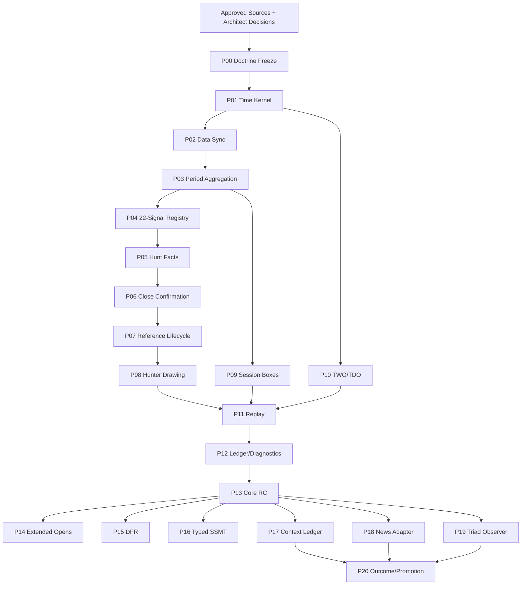

  ---
  id: EXP0018-MASTER-BLUEPRINT-V2
  title: "EXP0018 Master Implementation Blueprint v2"
  type: architecture
  status: active
  project: EXP0018
  version: 2.0.0
  created: 2026-07-10
  updated: 2026-07-10
  tags:
    - exp0018
- daye-trader
- implementation-design
  ---
# نقشه مادر پیاده‌سازی EXP0018
## مسیر کلان

## وضعیت فازها
| فاز | نام | Track | وضعیت | Dependencies |
|---|---|---|---|---|
| P00 | انجماد دکترین نسخه ۲ و خط مبنای تصمیم‌ها | core | `blocked_decisions_open` | — |
| P01 | هسته زمان نیویورک و تقویم | core | `foundation_exists_requires_validation` | P00 |
| P02 | همگام‌سازی داده چندنمادی | core | `not_started` | P01 |
| P03 | تجمیع دوره‌ها و کامل‌بودن آن‌ها | core | `not_started` | P02 |
| P04 | رجیستری اعلامی ۲۲ رابطه | core | `blocked_by_doctrine` | P00, P03 |
| P05 | تشخیص هانت و Snapshot مرجع | core | `blocked_by_doctrine` | P04 |
| P06 | ماشین حالت تأیید در کلوز | core | `not_started` | P05 |
| P07 | چرخه عمر مرجع و سیاست First Sweep | core | `blocked_by_doctrine` | P06 |
| P08 | رویداد تصویری تغییرناپذیر و رسم واگرایی | core | `not_started` | P07 |
| P09 | رندر باکس‌های سشن | core | `not_started` | P03 |
| P10 | رندر Anchorهای TWO و TDO | core | `blocked_by_doctrine` | P00, P01 |
| P11 | موتور بازپخش تاریخی و Backfill | core | `not_started` | P08, P09, P10 |
| P12 | دفتر ممیزی و Diagnostics | core | `not_started` | P06, P07, P11 |
| P13 | کنترل کیفیت، اعتبارسنجی ناظر و نسخه آزمایشی Core | core | `not_started` | P12 |
| P14 | رجیستری توسعه‌یافته True Open | optional | `optional_not_admitted` | P13 |
| P15 | موتور پژوهشی DFR و Projection | optional | `optional_not_admitted` | P13 |
| P16 | موتور پژوهشی انواع SSMT | optional | `optional_not_admitted` | P13 |
| P17 | دفتر Featureهای زمینه‌ای | optional | `optional_not_admitted` | P13 |
| P18 | Adapter خبر و زمان رویداد | optional | `optional_not_admitted` | P13 |
| P19 | ناظر Triad و Intermarket | optional | `optional_not_admitted` | P13 |
| P20 | مطالعه نتیجه و دروازه ارتقای قانون | optional | `optional_not_admitted` | P17, P18, P19 |

## معیار عبور از هر فاز

هر فاز فقط با این شواهد بسته می‌شود:

- specification و API contract تأییدشده
- state/event/invariant کامل
- test fixtures مثبت، منفی و boundary
- compile/static evidence
- replay/visual/schema evidence متناسب با فاز
- documentation + Obsidian + rollback
- هیچ warning یا risk پنهان
