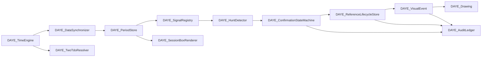

  ---
  id: EXP0018-RUNTIME-ARCHITECTURE-MAP-V2
  title: "EXP0018 Runtime Architecture Map v2"
  type: architecture
  status: active
  project: EXP0018
  version: 2.0.0
  created: 2026-07-10
  updated: 2026-07-10
  tags:
    - exp0018
- daye-trader
- implementation-design
  ---

# معماری Runtime

## State owners

| State | Owner |
|---|---|
| last processed closed candle | ClosedBarClock |
| synchronized bars/cache | DataSynchronizer |
| period snapshots | PeriodStore |
| candidate/confirmed state | ConfirmationStateMachine |
| active/retired references | ReferenceLifecycleStore |
| chart object registry | ObjectRegistry |
| file run identity | RunManifest |

هیچ owner دیگری حق mutation این stateها را ندارد.
