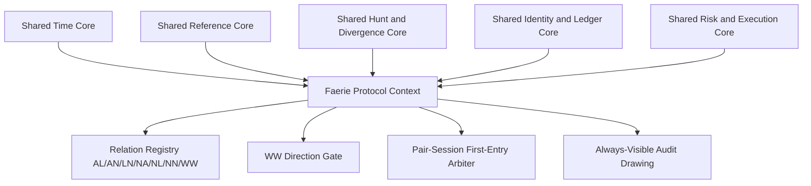

# 00 - EXP0019 Faerie Protocol Contextual Divergence - Master MOC

## Executive Summary

EXP0019 defines **Faerie Protocol** as a standalone contextual-divergence policy layered on top of the project's stable intermarket-divergence cores. It is not a replacement detector and it must not fork time, reference, hunt, role, confirmation, identity, ledger, risk, or execution primitives that already exist and pass compatibility tests.

The context introduces four window families (`A`, `L`, `N`, `W`), seven relation codes (`AL`, `AN`, `LN`, `NA`, `NL`, `NN`, `WW`), calendar-day historical selection, strict same-session confirmation, M1-only first-sweep authority, host-chart confirmation, a New York trading-week definition, an active-WW recency gate, pair-global first-entry arbitration, SELL stop spread adjustment, and persistent visibility of suppressed signals.

Fourteen owner decisions are frozen. One decision remains open: **the exact moment at which the pair-session quota becomes permanently consumed for live execution**. That single open item does not block detection, drawing, historical replay, candidate confirmation, WW gating, setup ranking, quota reservation, or paper execution. It does block a hard-coded live-order consumption rule.

## Architectural Position

## Frozen Owner-Decision Snapshot

| Question | Canonical Policy | Status |
|---:|---|---|
| 1 | `CALENDAR_DAY_DEPTH` | `OWNER_CONFIRMED` |
| 2 | `ALLOW_UNTIL_PROTECTED_TOUCH` | `OWNER_CONFIRMED` |
| 3 | `STRICT_SAME_SESSION_CLOSE` | `OWNER_CONFIRMED` |
| 4 | `M1_ONLY` | `OWNER_CONFIRMED` |
| 5 | `HOST_CHART_TIMEFRAME_RESOLVED_AT_INIT` | `OWNER_CONFIRMED` |
| 6 | `NY_TRADING_WEEK_SUN_1800_TO_FRI_1700` | `OWNER_CONFIRMED` |
| 7 | `NEUTRALIZE_ON_SECOND_SYMBOL_TOUCH` | `OWNER_CONFIRMED` |
| 8 | `WW_GATE_AND_TRADEABLE_SETUP` | `OWNER_CONFIRMED` |
| 9 | `ALLOW_BOTH_DIRECTIONS_WHEN_NO_ACTIVE_WW` | `OWNER_CONFIRMED` |
| 10 | `NEWEST_ACTIVE_CONFIRMED_WW_WINS` | `OWNER_CONFIRMED` |
| 11 | `PAIR_GLOBAL_FIRST_ENTRY_PER_SESSION` | `OWNER_CONFIRMED` |
| 12 | `OPEN_QUOTA_CONSUMPTION_MOMENT` | `OPEN_DECISION` |
| 13 | `EARLIEST_HUNT_M1_TIME_WINS` | `OWNER_CONFIRMED` |
| 14 | `SELL_STOP_PLUS_ONE_SPREAD` | `OWNER_CONFIRMED` |
| 15 | `ALWAYS_DRAW_WITH_DISTINCT_STYLE` | `OWNER_CONFIRMED` |

## Documentation Map

### Foundations

- [[01_SOURCE_PACKAGE_INVENTORY|Source Package Inventory]]
- [[02_SOURCE_TRANSCRIPTION_AND_OWNER_INTENT|Source Transcription and Owner Intent]]
- [[03_CANONICAL_STRATEGY_DOCTRINE|Canonical Strategy Doctrine]]
- [[04_CONTEXT_BOUNDARY_AND_SEPARATION|Context Boundary and Separation]]
- [[05_SHARED_CORE_REUSE_MATRIX|Shared Core Reuse Matrix]]
- [[06_CANONICAL_GLOSSARY|Canonical Glossary]]

### Time, Sessions, and Windows

- [[07_TIME_AND_DST_CONTRACT|Time and DST Contract]]
- [[08_TRADING_DAY_AND_SESSION_CALENDAR|Trading Day and Session Calendar]]
- [[31_DATA_GAPS_EXPIRY_WEEKENDS|Data Gaps, Expiry, Weekends, and Calendar-Day Depth]]

### Relations and Detection

- [[09_SYMBOL_PAIR_AND_ROLE_MODEL|Symbol Pair and Role Model]]
- [[10_SIGNAL_TAXONOMY_AND_RELATION_REGISTRY|Signal Taxonomy and Relation Registry]]
- [[11_AL_AN_LN_SAME_DAY_RELATIONSHIPS|AL, AN, and LN Same-Day Relations]]
- [[12_NA_NL_NN_CROSS_DAY_RELATIONSHIPS|NA, NL, and NN Cross-Day Relations]]
- [[13_WW_WEEKLY_CONTEXT_RELATION|WW Weekly Context Relation]]
- [[14_REFERENCE_FIELD_CONTRACT|Reference Field Contract]]
- [[15_HUNT_TOUCH_AND_FIRST_SWEEP_CONTRACT|Hunt, Touch, and First-Sweep Contract]]
- [[16_REFERENCE_FRESHNESS_CONSUMPTION_LIFECYCLE|Reference Freshness and Consumption Lifecycle]]
- [[17_DIVERGENCE_CANDIDATE_CONFIRMATION_INVALIDATION|Candidate, Confirmation, and Invalidation]]
- [[18_CLOSED_CANDLE_PROJECTION|Closed-Candle Projection]]

### Policy, Execution, and Visual Evidence

- [[19_WEEKLY_DIRECTIONAL_GATE|Weekly Directional Gate]]
- [[20_ENTRY_ENTITLEMENT_AND_SESSION_QUOTA|Entry Entitlement and Session Quota]]
- [[21_EXECUTION_RISK_STOP_TARGET_CONTRACT|Execution, Risk, Stop, and Target Contract]]
- [[22_DRAWING_AND_SESSION_BOX_CONTRACT|Drawing and Session-Box Contract]]
- [[23_SIGNAL_IDENTITY_DEDUP_AND_LEDGER|Signal Identity, Deduplication, and Ledger]]
- [[45_REASON_CODES_AND_VISUAL_STYLE_REGISTRY|Reason Codes and Visual Style Registry]]
- [[46_EXECUTION_ARBITRATION_AND_FIRST_SIGNAL_POLICY|Execution Arbitration and First-Signal Policy]]
- [[47_WW_ACTIVE_CONTEXT_STACK_AND_RECENCY|WW Active Context Stack and Recency]]

### Formal Design and Delivery

- [[24_STATE_MACHINES|State Machines]]
- [[25_DATA_CONTRACTS|Data Contracts]]
- [[26_INPUTS_AND_CONFIGURATION_CONTRACT|Inputs and Configuration Contract]]
- [[27_MQL5_MODULAR_ARCHITECTURE|MQL5 Modular Architecture]]
- [[28_EXISTING_MODULE_ADAPTER_PLAN|Existing Module Adapter Plan]]
- [[29_LEGACY_FP101_CODE_AUDIT|Legacy FP101 Code Audit]]
- [[30_PERFORMANCE_INCREMENTAL_RUNTIME|Performance and Incremental Runtime]]
- [[32_TEST_STRATEGY_AND_GOLDEN_CASES|Test Strategy and Golden Cases]]
- [[33_AMBIGUITY_AND_DECISION_REGISTER|Decision Register]]
- [[34_IMPLEMENTATION_ROADMAP|Implementation Roadmap]]
- [[35_HANDOFF_TO_CODE|Handoff to Code]]
- [[36_TRACEABILITY_MATRIX|Traceability Matrix]]
- [[37_LIMITS_NON_GOALS_AND_GOVERNANCE|Limits, Non-Goals, and Governance]]
- [[38_OWNER_DECISION_FREEZE_V2|Owner Decision Freeze v2]]
- [[39_QUOTA_CONSUMPTION_EXPLAINER_AND_OPEN_DECISION|Quota Consumption Explainer]]
- [[40_NORMATIVE_ALGORITHM_SPECIFICATION|Normative Algorithm Specification]]
- [[41_RELATION_BY_RELATION_RULEBOOK|Relation-by-Relation Rulebook]]
- [[42_EDGE_CASE_CATALOG|Edge-Case Catalog]]
- [[43_CONFIGURATION_AND_MANIFEST_V2|Configuration and Manifest v2]]
- [[44_ACCEPTANCE_GATE_FOR_CODING|Acceptance Gate for Coding]]
- [[48_FORMAL_INVARIANTS_AND_MODEL_CHECKS|Formal Invariants and Model Checks]]

## Implementation Readiness

| Capability | Readiness | Blocking Item |
|---|---:|---|
| Time/session/window engine | Ready | None |
| Reference generation | Ready | None |
| AL/AN/LN/NA/NL/NN detection | Ready | None |
| WW detection and neutralization | Ready | None |
| Confirmation and invalidation | Ready | None |
| Drawing and audit visibility | Ready | None |
| Pair-session arbitration | Ready | None |
| Paper execution | Ready with explicit quota-consumption profile | Policy selection required |
| Live execution | Not fully frozen | FP-DEC-012 |

## Non-Negotiable Governance

- Missing data is never reclassified as a valid absence of a signal.
- Suppression never deletes raw detection evidence.
- The current chart timeframe is behavior-bearing and must be resolved into the configuration hash.
- The calendar-day selector must not backfill missing offsets with older valid N sessions.
- M1 is the only authority for first-sweep ordering in both historical and live modes.
- Same-minute dual touch is symmetric/ambiguous; ticks may not be used to invent an order.
- A SELL stop spread adjustment must be included in risk sizing before any order request.
- WW recency selects the active gate but never rewrites older weekly events.

## Authority Classification

| Classification | Meaning |
|---|---|
| `OWNER_CONFIRMED` | Explicitly selected by the owner in the 15-question decision response. |
| `SOURCE_CONFIRMED` | Directly present in the original Faerie Protocol source package or owner narrative. |
| `ARCHITECTURAL_DERIVATION` | Required to make the confirmed behavior deterministic, modular, testable, or compatible with shared cores. |
| `LEGACY_OBSERVATION` | Behavior observed in `FP 101.mq5`; not automatically canonical. |
| `OPEN_DECISION` | Must not be silently hard-coded. |

Canonical priority is: `OWNER_CONFIRMED` > `SOURCE_CONFIRMED` > reviewed `ARCHITECTURAL_DERIVATION` > `LEGACY_OBSERVATION`.

## Navigation

- [[00_EXP0019_MOC|EXP0019 Master MOC]]
- [[38_OWNER_DECISION_FREEZE_V2|Owner Decision Freeze v2]]
- [[33_AMBIGUITY_AND_DECISION_REGISTER|Decision Register]]
- [[40_NORMATIVE_ALGORITHM_SPECIFICATION|Normative Algorithm Specification]]
- [[44_ACCEPTANCE_GATE_FOR_CODING|Acceptance Gate for Coding]]
