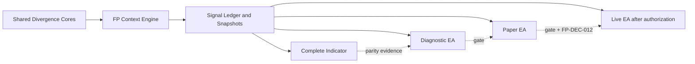

# Faerie Protocol Implementation Program

## Executive decision

The implementation is organized as a controlled sixteen-plus-one phase program. The complete indicator is a mandatory production milestone and is finished before any execution authority is introduced. All products consume one shared Faerie Protocol engine and ledger.

## Program outcomes

```text
FP-I00..FP-I09  → accepted semantic context engine
FP-I10..FP-I13  → complete Faerie Protocol Indicator
FP-I14          → diagnostic EA and cross-product parity
FP-I15          → paper execution
FP-I16          → gated live execution and monitoring
```

## Core/indicator/EA separation



## Supporting architecture documents

- [[01_PROGRAM_CHARTER_AND_DELIVERY_PRINCIPLES|Program Charter and Delivery Principles]]
- [[02_PRODUCT_SURFACES_AND_RELEASE_PROFILES|Product Surfaces and Release Profiles]]
- [[03_DEPENDENCY_GRAPH_AND_CRITICAL_PATH|Dependency Graph and Critical Path]]
- [[04_TARGET_REPOSITORY_AND_FILE_ARCHITECTURE|Target Repository and File Architecture]]
- [[05_SHARED_CORE_REUSE_AND_COMPATIBILITY_STRATEGY|Shared-Core Reuse and Compatibility Strategy]]
- [[06_PHASE_DELIVERY_CONTRACT_AND_DEFINITION_OF_DONE|Phase Delivery Contract and Definition of Done]]
- [[07_COMPLETE_INDICATOR_PRODUCT_REQUIREMENTS|Complete Indicator Product Requirements]]
- [[08_INDICATOR_RUNTIME_LIFECYCLE_AND_EVENT_MODEL|Indicator Runtime Lifecycle and Event Model]]
- [[09_INDICATOR_VISUAL_LANGUAGE_AND_OBJECT_IDENTITY|Indicator Visual Language and Object Identity]]
- [[10_INDICATOR_INPUT_GROUPS_AND_CONFIGURATION_PLAN|Indicator Input Groups and Configuration Plan]]
- [[11_TEST_PYRAMID_FIXTURES_AND_ACCEPTANCE_EVIDENCE|Test Pyramid, Fixtures, and Acceptance Evidence]]
- [[12_PERFORMANCE_MEMORY_AND_OBJECT_BUDGETS|Performance, Memory, and Object Budgets]]
- [[13_BUILD_PACKAGING_COMMIT_AND_RELEASE_WORKFLOW|Build, Packaging, Commit, and Release Workflow]]
- [[14_PROGRAM_RISK_REGISTER_AND_ROLLBACK_STRATEGY|Program Risk Register and Rollback Strategy]]
- [[15_IMPLEMENTATION_PROGRAM_HANDOFF_MATRIX|Implementation Program Handoff Matrix]]
- [[16_WORK_BREAKDOWN_STRUCTURE_AND_TASK_LEDGER|Work Breakdown Structure and Task Ledger]]
- [[17_COMPLETE_INDICATOR_DELIVERY_BLUEPRINT|Complete Indicator Delivery Blueprint]]
- [[18_CROSS_PRODUCT_SEMANTIC_PARITY_CONTRACT|Cross-Product Semantic Parity Contract]]
- [[19_PHASE_BY_PHASE_TEST_CATALOG|Phase-by-Phase Test Catalog]]
- [[20_IMPLEMENTATION_SEQUENCE_COMMANDMENTS|Implementation Sequence Commandments]]

## Implementation phases

- [[phases/FP_I00_GOVERNANCE_BASELINE_FREEZE_AND_SOURCE-CONTROL_HARNESS|FP-I00 — Governance, Baseline Freeze, and Source-Control Harness]]
- [[phases/FP_I01_SHARED-CORE_COMPATIBILITY_HARNESS_AND_ADAPTER_CONTRACTS|FP-I01 — Shared-Core Compatibility Harness and Adapter Contracts]]
- [[phases/FP_I02_CONTRACTS_ENUMS_IDENTITY_CONFIGURATION_AND_REASON_CODES|FP-I02 — Contracts, Enums, Identity, Configuration, and Reason Codes]]
- [[phases/FP_I03_NEW_YORK_TIME_TRADING-DAY_SESSION_AND_WEEK_KERNEL|FP-I03 — New York Time, Trading-Day, Session, and Week Kernel]]
- [[phases/FP_I04_MULTI-SYMBOL_M1_SYNCHRONIZATION_COVERAGE_AND_DATA_REVISION|FP-I04 — Multi-Symbol M1 Synchronization, Coverage, and Data Revision]]
- [[phases/FP_I05_SESSION_WEEK_WINDOW_STORE_CALENDAR-DAY_SELECTOR_AND_REFERENCE_ENGINE|FP-I05 — Session/Week Window Store, Calendar-Day Selector, and Reference Engine]]
- [[phases/FP_I06_RELATION_COMPILER_HUNT_FACTS_FIRST-SWEEP_CLASSIFICATION_AND_CANDIDATES|FP-I06 — Relation Compiler, Hunt Facts, First-Sweep Classification, and Candidates]]
- [[phases/FP_I07_HOST-CANDLE_CONFIRMATION_STRICT_SESSION_DEADLINE_INVALIDATION_AND_LIFECYCLE|FP-I07 — Host-Candle Confirmation, Strict Session Deadline, Invalidation, and Lifecycle]]
- [[phases/FP_I08_WEEKLY_WW_DETECTION_NEUTRALIZATION_ACTIVE_STACK_AND_DIRECTIONAL_POLICY|FP-I08 — Weekly WW Detection, Neutralization, Active Stack, and Directional Policy]]
- [[phases/FP_I09_SIGNAL_LEDGER_DEDUPLICATION_PAIR-SESSION_ARBITRATION_CHECKPOINTS_AND_RESTART|FP-I09 — Signal Ledger, Deduplication, Pair-Session Arbitration, Checkpoints, and Restart]]
- [[phases/FP_I10_COMPLETE_INDICATOR_SHELL_ENGINE_COMPOSITION_HEALTH_AND_MACHINE-READABLE_OUTPUTS|FP-I10 — Complete Indicator Shell, Engine Composition, Health, and Machine-Readable Outputs]]
- [[phases/FP_I11_INDICATOR_VISUAL_PROJECTION_SESSIONS_REFERENCES_HUNTS_SIGNALS_WW_AND_SUPPRESSION|FP-I11 — Indicator Visual Projection: Sessions, References, Hunts, Signals, WW, and Suppression]]
- [[phases/FP_I12_INDICATOR_PANEL_FILTERS_ALERTS_AUDIT_EXPORT_AND_OPERATOR_UX|FP-I12 — Indicator Panel, Filters, Alerts, Audit Export, and Operator UX]]
- [[phases/FP_I13_INDICATOR_HISTORICAL_REPLAY_INCREMENTAL_PERFORMANCE_MULTI-CHART_ISOLATION_AND_RELEASE|FP-I13 — Indicator Historical Replay, Incremental Performance, Multi-Chart Isolation, and Release]]
- [[phases/FP_I14_DIAGNOSTIC_EA_AND_CROSS-PRODUCT_DIFFERENTIAL_VALIDATION|FP-I14 — Diagnostic EA and Cross-Product Differential Validation]]
- [[phases/FP_I15_RISK_GEOMETRY_PAIR-SESSION_RESERVATION_AND_PAPER_EXECUTION|FP-I15 — Risk Geometry, Pair-Session Reservation, and Paper Execution]]
- [[phases/FP_I16_LIVE_EXECUTION_DECISION_GATE_AUTHORIZATION_MICRO-RELEASE_AND_MONITORING|FP-I16 — Live Execution Decision Gate, Authorization, Micro-Release, and Monitoring]]

## Indicator release gate

The complete indicator release is accepted only after FP-I13 proves:

- exact semantic replay parity;
- exact restart identity/state parity;
- detection independence from chart timeframe changes;
- instance-safe object identity and cleanup;
- correct rendering of every raw/confirmed/suppressed/neutralized state;
- alert deduplication and append-only export;
- acceptable measured latency, memory, and object budgets.

No Paper or Live phase may create a private or simplified detector to bypass this gate.

## Open decision treatment

`FP-DEC-012` remains open. It does not block FP-I00 through FP-I14 or the full indicator. FP-I15 may use explicitly labelled paper-only quota profiles. FP-I16 cannot be accepted until the owner freezes the live quota consumption/release lifecycle.

## Navigation

- [[../00_EXP0019_MOC|EXP0019 Master MOC]]
- [[../34_IMPLEMENTATION_ROADMAP|Implementation Roadmap]]
- [[../44_ACCEPTANCE_GATE_FOR_CODING|Acceptance Gate for Coding]]
