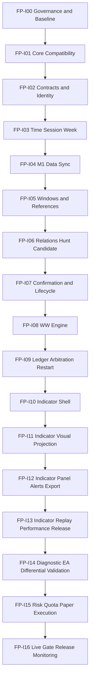

# Dependency Graph and Critical Path

## Program dependency graph



## Critical path

The critical path is `I00 → I01 → I02 → I03 → I04 → I05 → I06 → I07 → I08 → I09 → I10 → I11 → I12 → I13`. This path ends at the complete indicator release and is not blocked by the unresolved live quota-consumption decision.

Execution development branches after the indicator release:

```text
Complete Indicator
      ↓
Diagnostic EA
      ↓
Paper EA
      ↓
FP-DEC-012 freeze + broker safety evidence
      ↓
Live EA
```

## Parallelizable work

After I02 contracts are frozen, the following may proceed in parallel but cannot be merged before their dependency gate:

- fixture generation for later relation tests;
- visual style prototypes using synthetic signals;
- documentation and input catalog review;
- performance benchmark harnesses;
- migration analysis of legacy FP101 drawings.

## Forbidden parallelization

- Implementing WW gate before basic relation lifecycle is stable.
- Implementing indicator-specific detection instead of waiting for the shared context engine.
- Implementing live order logic before paper reconciliation and `FP-DEC-012` freeze.
- Optimizing away audit fields before golden parity exists.
