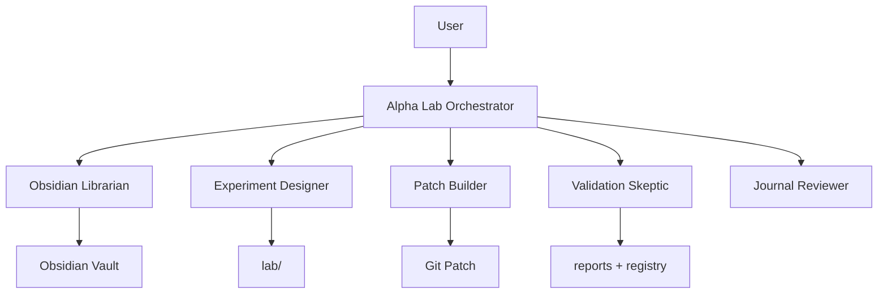

# Alpha Lab Agent Operating Model

Agent آینده پروژه باید ابتدا research/knowledge/patch assistant باشد، نه live trading authority.

## Layering

## Hard rules

1. Agent حق ارسال live order ندارد.
2. Agent حق افزایش risk ندارد.
3. Agent حق bypass کردن validation ندارد.
4. Agent باید هر تغییر را به diff و rollback plan وصل کند.
5. Agent باید هر experiment را به hypothesis و هر validation را به experiment وصل کند.
6. Agent باید negative result را حذف نکند؛ archive کند.
7. Agent باید برای هر claim مثبت baseline بخواهد.

## First useful agents

- [[docs/obsidian/05_agents/obsidian_librarian_agent|Obsidian Librarian Agent]]
- [[docs/obsidian/05_agents/experiment_designer_agent|Experiment Designer Agent]]
- [[docs/obsidian/05_agents/patch_builder_agent|Patch Builder Agent]]
- [[docs/obsidian/05_agents/validation_skeptic_agent|Validation Skeptic Agent]]
