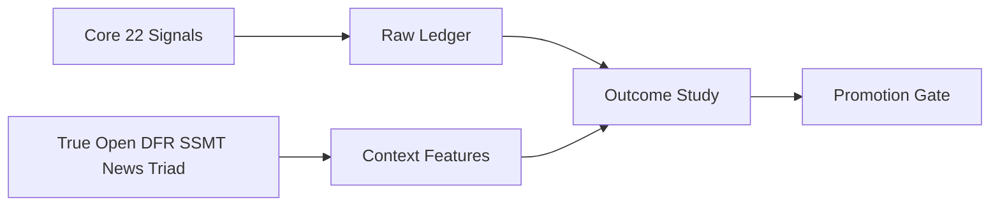

# Canonical / Enrichment Boundary

```mermaid
flowchart LR
C[Core 22 Signals] --> L[Raw Ledger]
E[True Open DFR SSMT News Triad] --> F[Context Features]
L --> O[Outcome Study]
F --> O
O --> G[Promotion Gate]
```
