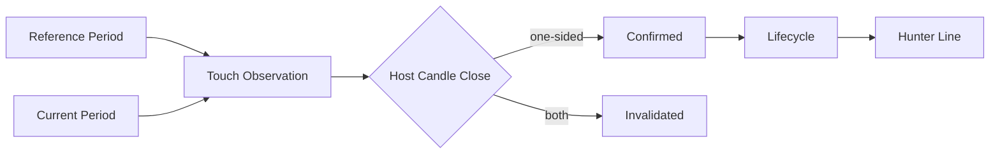

  ---
  id: EXP0018_Signal_Formation_Design_Map
  title: "EXP0018 Signal Formation Design Map"
  type: decision-map
  status: active
  project: EXP0018
  version: 2.0.0
  created: 2026-07-10
  updated: 2026-07-10
  tags:
    - exp0018
- decision-map
- implementation-design
  ---
# EXP0018 Signal Formation Design Map

