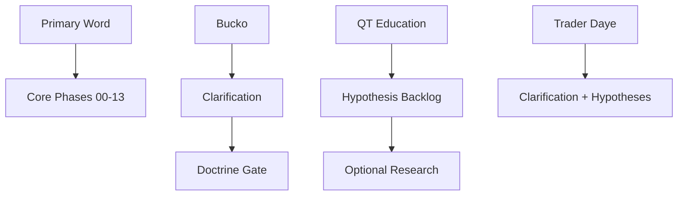

# Source to Implementation Map

```mermaid
flowchart TD
Word[Primary Word] --> Core[Core Phases 00-13]
Bucko[Bucko] --> Clarify[Clarification]
QT[QT Education] --> Hyp[Hypothesis Backlog]
Daye[Trader Daye] --> Both[Clarification + Hypotheses]
Clarify --> Gate[Doctrine Gate]
Hyp --> Research[Optional Research]
```
