# Setup AI Edge Discovery — Home

> [!abstract] Mission
> Build a reusable, context-compatible learning system that searches for defensible exploitation policies across explicit payoff profiles and entry mechanisms, while remaining causally valid, economically executable, statistically conservative, reproducible, and compilable into the existing UCEE policy/runtime chain.

## Canonical Pipeline

```mermaid
flowchart LR
  A[Immutable Context Package] --> B[Context Occurrence Snapshot]
  B --> C[Setup Archetype Router]
  C --> D[Payoff Profile Registry]
  C --> E[Entry Mechanism Registry]
  D --> F[Treatment Universe Compiler]
  E --> F
  F --> G[Counterfactual Outcome Cube]
  G --> H[Clustered Dataset Factory]
  H --> I[Trainer Task Graph]
  I --> J[Experiment DAG and Search Ledger]
  J --> K[Anti-Overfit Promotion Gate]
  K --> L[Manual / AI / Hybrid Policy Graph]
  L --> M[Immutable Runtime Handoff]
  M --> N[Portfolio / Production Qualification]
```



## What This System Learns

The learner does **not** invent market meaning. It receives a valid Context occurrence and learns whether any governed Treatment can exploit that occurrence. Its output is one of:

- select a complete Treatment bundle;
- select a simpler manual baseline;
- defer to a fallback policy;
- abstain because evidence, support, economics, or runtime health is insufficient;
- reject the entire setup family.

## What “Entry Style” Means Here

The user's entry styles are formalized into separate axes:

1. **Payoff Profile** — desired payoff distribution and stop/exit philosophy.
2. **Entry Mechanism** — breakout, immediate market, or pullback/limit activation.
3. **Trigger Philosophy** — anticipatory, context-immediate, or confirmatory.
4. **Stop Geometry** — where the thesis is invalidated.
5. **Exit Architecture** — fixed destination, open trail, partial/runner, or time/structural exit.
6. **Path Dependence** — whether only origin/destination matter or the exact path must be replayed.

The complete learned action is therefore:

```text
Context Occurrence
+ Payoff Profile
+ Entry Mechanism
+ Trigger Philosophy
+ Stop Geometry
+ Exit Architecture
+ Management Policy
+ Risk Eligibility
= Complete Treatment Candidate
```

## Navigation

- [[01_Master_Architecture]]
- [[02_Persian_Executive_Overview]]
- [[03_UCEE_Compatibility_Map]]
- [[10_Payoff_And_Entry_Style_System]]
- [[30_Trainer_Task_Graph]]
- [[50_Anti_Overfit_Master_Protocol]]
- [[70_Implementation_Roadmap]]
- [[90_EXP0017_F2_End_To_End_Example]]
