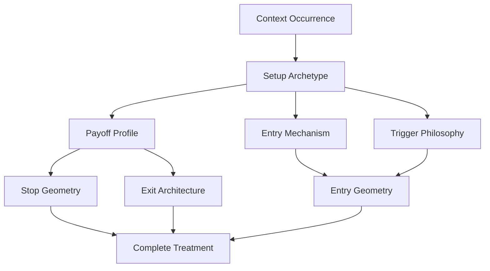

# Payoff and Entry Style System

## Axes

## Mandatory Axes

1. Payoff profile.
2. Entry mechanism.
3. Trigger philosophy.
4. Entry geometry.
5. Stop geometry.
6. Exit architecture.
7. Management/re-entry.
8. Expiry and time policy.
9. Cost/execution profile.
10. Risk eligibility, not final sizing.

## Search Discipline

The system does not cross every value with every other value. A compatibility graph removes semantically invalid, causally impossible, broker-infeasible, cost-infeasible, dominated and unsupported combinations before training.
