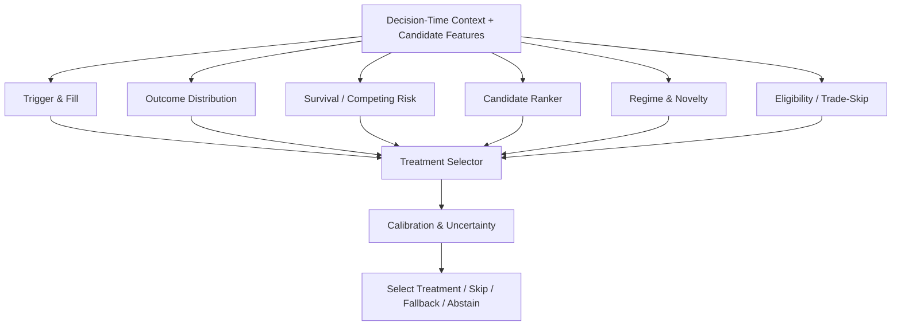

# Universal Trainer Task Graph

## Task Graph

## Principle

Do not force one monolithic model to solve every task. Use task-compatible plugins and compose outputs through a versioned selector. A multi-task model is a challenger that must beat specialist baselines.

## OOF Requirement

Every downstream selector, calibrator or ensemble is trained on out-of-fold upstream predictions, never in-sample predictions.
