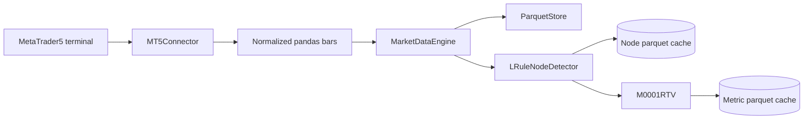
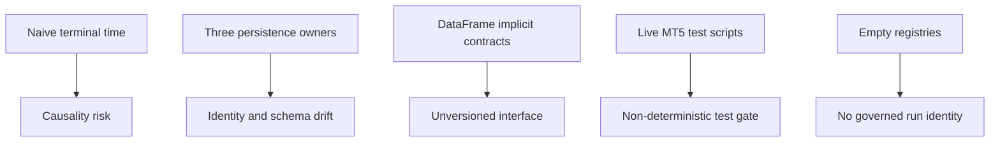
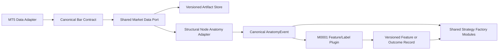
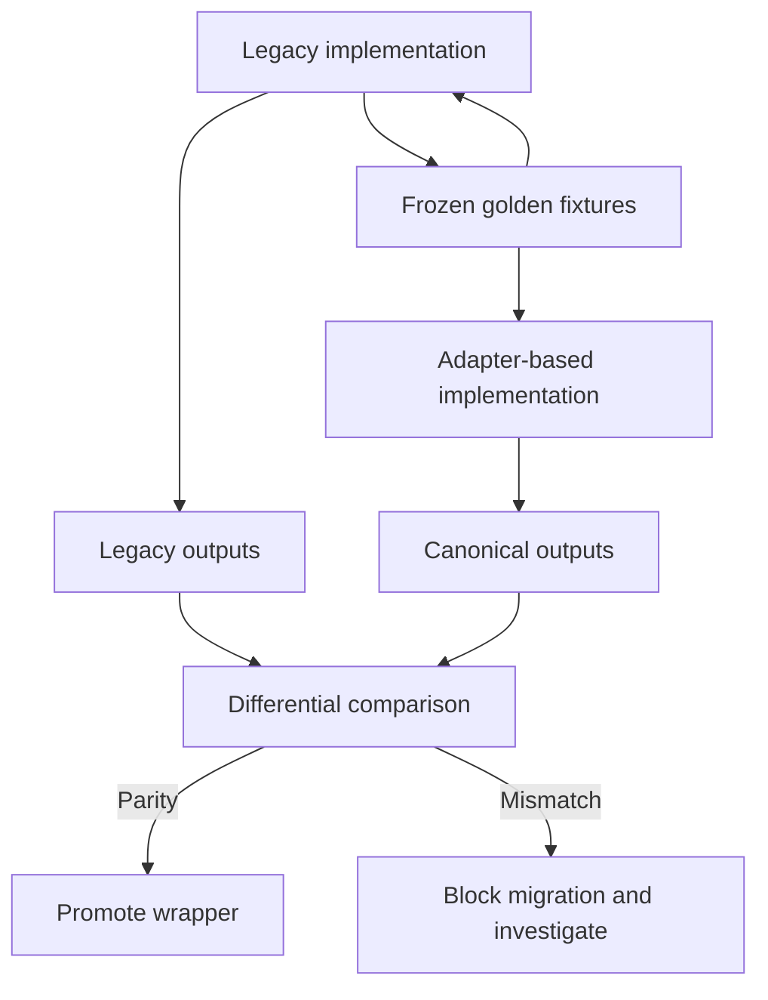

# Current-to-Target Architecture

## Current implemented flow

## Problems in the current flow

## Target migration shape

## Compatibility strategy

## Non-negotiable boundary

The structural-node detector remains on the anatomy side of the adapter. The shared Factory receives an event contract; it does not call internal detector rules or infer what a node should be.
