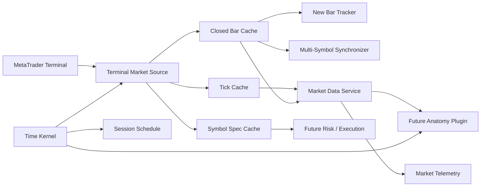

# Component map



## Hot path

The hot path avoids file I/O, parsing, dynamic discovery, and full-history scans:

```text
tick arrives
→ update latest-tick state
→ refresh required closed bars only when needed
→ mark changed series generation
→ evaluate freshness and synchronization
→ expose typed snapshots
```

## Cold path

Startup and recovery may:

- select symbols;
- preload bounded history;
- read symbol specifications;
- validate broker offset;
- build session schedules;
- run synchronization warm-up;
- emit health diagnostics.

## Dependency direction

```text
Contracts
↓
Core and Ports
↓
Market Services
↓
Future Plugin SDK
↓
Anatomy Adapters
```

Market services do not depend on anatomy or execution. The terminal adapter depends on market contracts, but the contracts never depend on terminal APIs.

## State generations

Tick state, bar series, and symbol specifications carry generations. Downstream context caches will use these generations to recalculate only dirty features. This is the basis for low-latency Context → Decision processing in later phases.
