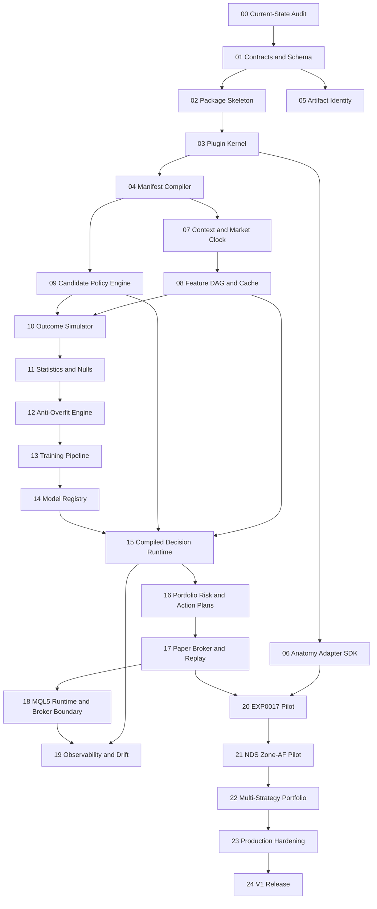

# Phase Dependency Graph

## Parallelization Rules

- Phases 03 and 05 may proceed in parallel after Phase 02.
- Phases 07 and 09 may proceed in parallel after the compiler is stable.
- Documentation, fixtures, and static schemas can be prepared one phase ahead.
- MQL5 runtime work must not begin before Python reference behavior and cross-language fixtures exist.
- Live execution work must not begin before paper replay parity is measurable.
