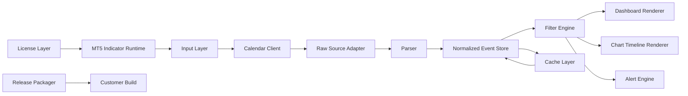

# gartal terminal — Implementation Master Plan

> Product goal: build a premium MT5 economic-news terminal that reads Forex Factory-style calendar data, normalizes all events into broker time, renders a luxury dashboard and forward timeline on the chart, and gives traders configurable alerts before and during market-moving events.

## Navigation

- [[implementation/00_INDEX|Implementation Index]]
- [[implementation/01_foundation_and_contracts|Phase 01 — Foundation & Contracts]]
- [[implementation/02_data_acquisition_forex_factory_adapter|Phase 02 — Data Acquisition & Forex Factory Adapter]]
- [[implementation/03_time_normalization_and_broker_gmt|Phase 03 — Time Normalization & Broker GMT]]
- [[implementation/04_event_model_filter_engine|Phase 04 — Event Model & Filter Engine]]
- [[implementation/05_dashboard_ui_implementation|Phase 05 — Dashboard UI Implementation]]
- [[implementation/06_chart_timeline_renderer|Phase 06 — Chart Timeline Renderer]]
- [[implementation/07_alert_engine_implementation|Phase 07 — Alert Engine]]
- [[implementation/08_cache_resilience_and_failover|Phase 08 — Cache, Resilience & Failover]]
- [[implementation/09_packaging_licensing_distribution|Phase 09 — Packaging, Licensing & Distribution]]
- [[implementation/10_validation_qa_release_gate|Phase 10 — Validation, QA & Release Gate]]
- [[implementation/11_next_build_sprints|Next Build Sprints]]
- [[gartal_terminal_implementation_architecture.canvas|Implementation Architecture Canvas]]

## North-Star Architecture

## Implementation Doctrine

The product must be built as a terminal, not a decorative indicator. Every module must have a clear contract and must be replaceable without rewriting the rest of the system.

### Non-Negotiables

1. **Source independence:** Forex Factory direct parsing must be isolated behind an adapter.
2. **Time correctness:** all displayed news must be normalized to broker time using explicit or auto-detected GMT offset.
3. **UI controllability:** all filters must be available from the dashboard, not only from MT5 inputs.
4. **Chart clarity:** event lines must never make the chart unreadable.
5. **Alert discipline:** alerts must fire once per stage per event, not repeatedly on every tick.
6. **Commercial readiness:** release files, versioning, support notes, and licensing hooks must be part of the build path.

## Phase Map

| Phase | Output | Definition of Done |
|---|---|---|
| 01 | Compile-safe module contracts | Indicator compiles with sample events and no external network dependency |
| 02 | Forex Factory adapter | Raw calendar data is fetched or mocked through one replaceable adapter interface |
| 03 | Broker-time normalization | UTC/source time converts into broker/server time deterministically |
| 04 | Filter engine | Currency, impact, event type, date range, and breaking-event filters work consistently |
| 05 | Dashboard UI | Luxury dashboard renders event table, filters, next event, and status panels |
| 06 | Chart timeline | Future news is drawn forward on chart with event lines and bottom timeline labels |
| 07 | Alert engine | Popup, sound, push, email, and chart alerts are staged and de-duplicated |
| 08 | Cache/failover | Indicator remains usable when WebRequest fails or source is temporarily unavailable |
| 09 | Packaging/licensing | Release packager creates a clean customer build with license placeholders |
| 10 | QA/release gate | Stress-tested build is ready for beta distribution |

## Critical Engineering Risks

| Risk | Severity | Control |
|---|---:|---|
| Forex Factory HTML changes | High | Adapter isolation + parser fixtures + cache fallback |
| Broker GMT mismatch | High | Manual override + auto-detection diagnostics |
| UI object overload | Medium | Object pooling + capped row count + redraw throttling |
| Alert spam | High | Event-stage dedupe state + cooldown windows |
| Slow WebRequest | Medium | Fetch interval, cache, non-blocking UI updates where possible |
| Commercial data-rights ambiguity | High | Risk doc + alternative adapter slot + user-configurable source |

## Build Order

1. Build contracts and sample data path.
2. Build event normalization and filtering before UI polish.
3. Build minimal dashboard table.
4. Build chart timeline and bottom forward strip.
5. Build staged alerts.
6. Add source adapter and cache.
7. Harden UI and failure states.
8. Package beta build.
9. Validate on high-impact news days.

## Obsidian Usage

Use this note as the product execution hub. Each phase note contains:

- objective
- modules touched
- implementation tasks
- expected inputs/outputs
- acceptance criteria
- failure modes
- next links

