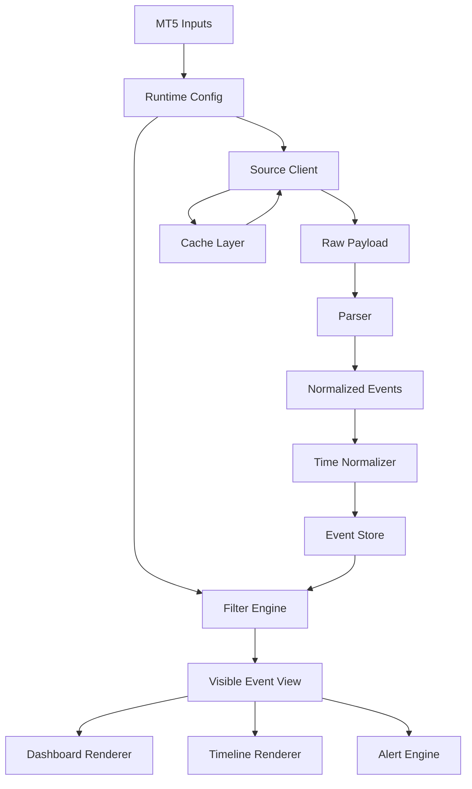

# Architecture Index — Gartal Terminal

## Core Documents

| Order | Document | Purpose |
|---:|---|---|
| 01 | [[01_system_architecture|System Architecture]] | Defines the complete product-level architecture and subsystem boundaries. |
| 02 | [[02_mql5_module_contracts|MQL5 Module Contracts]] | Defines each MQL5 include module, its responsibilities, inputs, outputs, and forbidden dependencies. |
| 03 | [[03_data_pipeline_and_source_strategy|Data Pipeline & Source Strategy]] | Defines how the product fetches, stores, parses, caches, and normalizes economic-calendar data. |
| 04 | [[04_forex_factory_parsing_contract|Forex Factory Parsing Contract]] | Defines the parser contract for Forex Factory style calendar rows and breaking/speech items. |
| 05 | [[05_time_and_gmt_architecture|Time & Broker GMT Architecture]] | Defines UTC, source time, broker time, display time, and auto GMT detection. |
| 06 | [[06_ui_runtime_filter_architecture|UI Runtime Filter Architecture]] | Defines dashboard runtime controls, filter state, button semantics, and event visibility rules. |
| 07 | [[07_alert_state_machine|Alert State Machine]] | Defines alert stages, duplicate prevention, delivery channels, and state persistence. |
| 08 | [[08_chart_rendering_object_model|Chart Rendering Object Model]] | Defines vertical lines, bottom timeline strip, row labels, and MT5 object lifecycle. |
| 09 | [[09_error_cache_resilience_architecture|Error, Cache & Resilience Architecture]] | Defines failure modes, cache fallback, retry policy, and visible source status. |
| 10 | [[10_engineering_execution_order|Engineering Execution Order]] | Converts architecture into implementation sequence and acceptance gates. |

## ADRs

| ADR | Decision |
|---|---|
| [[adr/ADR-0001-source-adapter-boundary|ADR-0001]] | Keep source fetching isolated from parsing and rendering. |
| [[adr/ADR-0002-sample-data-first|ADR-0002]] | Build sample-data pipeline before real Forex Factory parsing. |
| [[adr/ADR-0003-dashboard-runtime-config|ADR-0003]] | Dashboard toggles modify runtime config, not MT5 input variables. |
| [[adr/ADR-0004-object-prefix-discipline|ADR-0004]] | Every MT5 object must use the `GT_` object prefix discipline. |
| [[adr/ADR-0005-alert-idempotency|ADR-0005]] | Alerts must be idempotent by event/stage key. |

## Canvas

Open this in Obsidian:

```text
product_lab/indicators/gartal_terminal/obsidian/gartal_terminal_architecture_start.canvas
```

## Non-Negotiable Architecture Constraints

1. **No UI logic inside the source adapter.**
2. **No WebRequest logic inside the dashboard or alert module.**
3. **No raw HTML reaches the renderer.**
4. **No alert is dispatched without an idempotency key.**
5. **No object is created without the canonical prefix.**
6. **No broker-time display is trusted without the time normalization module.**
7. **No dashboard filter changes are allowed to mutate the event store.**
8. **No renderer should delete objects that it does not own.**

## Architecture Dependency Flow


