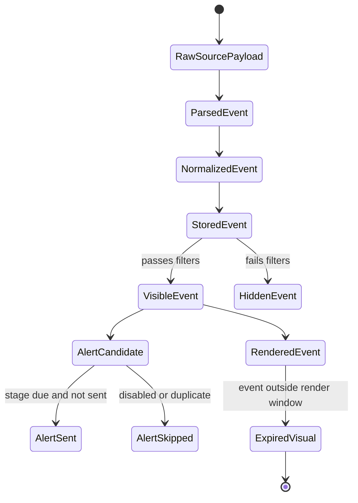

# 01 — System Architecture

## Product Definition

**gartal terminal** is an MT5 economic-news terminal that overlays scheduled and sudden macro events on the trading chart.

It must display events with the same mental model traders expect from an economic calendar:

- release time;
- currency;
- impact color;
- event title;
- forecast;
- previous;
- actual;
- tentative/revised/speech/breaking flags;
- next-event status;
- alert state.

The product is not limited to a static dashboard. It must also project the rest of the day's news into the future area of the chart through timeline objects.

## Architectural Style

The architecture is a modular pipeline:

```text
Configuration -> Acquisition -> Parsing -> Normalization -> Storage -> Filtering -> Rendering -> Alerting
```

Each module has one responsibility.

## Top-Level Runtime Loop

The main indicator runs the following loop:

```text
OnInit
  load inputs
  initialize runtime config
  initialize modules
  load sample/cache data if needed
  render initial shell

OnTimer
  refresh source when interval expires
  parse payload
  normalize event times
  update event store
  compute visible event view
  render dashboard
  render timeline and chart lines
  process alerts

OnChartEvent
  route dashboard clicks to runtime config
  recompute visible event view
  rerender dashboard/timeline

OnDeinit
  clean owned chart objects
  persist lightweight state if needed
```

## Subsystems

| Subsystem | Role | Owns State? | Output |
|---|---|---:|---|
| Input Loader | Converts MT5 inputs into canonical config | Yes | `GT_Config` |
| Runtime Config | Holds dashboard-editable filter state | Yes | `GT_FilterState` / `GT_Config` |
| Source Client | Fetches raw payload from source | No long-term | raw text payload |
| Parser | Converts source payload to events | No | `GT_NewsEvent[]` |
| Time Normalizer | Converts source time to UTC and broker time | No | normalized event times |
| Event Store | Holds canonical events | Yes | `GT_NewsStore` |
| Filter Engine | Builds visible event view | No | filtered event indices/view |
| Dashboard Renderer | Draws dashboard objects | Yes, UI object names | chart objects |
| Timeline Renderer | Draws vertical lines and bottom strip | Yes, UI object names | chart objects |
| Alert Engine | Dispatches alerts once per stage | Yes | alerts + sent-state |
| Cache Layer | Stores last usable payload/events | Yes | fallback payload/events |
| Diagnostics | Shows source/parse/time/render status | Yes | debug/status rows |

## Data Ownership Rule

There is only one canonical event store.

Renderers must not hold independent copies of events. They may hold object handles/names, layout state, and last-render fingerprints.

## Event Lifecycle



## Main Boundaries

### Source Boundary

The source client is allowed to know:

- source URL;
- request method;
- timeout;
- response status;
- raw payload string.

It is not allowed to know:

- dashboard rows;
- impact colors;
- chart object names;
- alert stages;
- broker display layout.

### Parser Boundary

The parser is allowed to know:

- raw source format;
- calendar row extraction;
- currency extraction;
- impact extraction;
- title extraction;
- actual/forecast/previous extraction;
- speech/breaking/tentative flags.

It is not allowed to draw or alert.

### Renderer Boundary

The renderer consumes normalized, filtered events only.

It is not allowed to parse HTML or fetch data.

## Performance Doctrine

MT5 object rendering must be diff-based where possible.

The product must avoid deleting and recreating all objects every tick. Heavy rerender is allowed only on:

- source refresh;
- dashboard filter change;
- chart size change;
- timeframe/symbol reinitialization;
- manual refresh.

## Commercial Doctrine

The architecture must support future licensing without rewriting the product.

License checks should later wrap the orchestrator and unlock modules by capability, but no license logic should pollute parser or renderer code.

## First Build Target

The first architecture-compliant build is not a full scraper.

The first build target is:

1. sample events;
2. correct broker-time projection;
3. dashboard shell;
4. filter buttons;
5. bottom timeline;
6. vertical event lines;
7. alert engine with sample events.

After that, attach the Forex Factory adapter.
