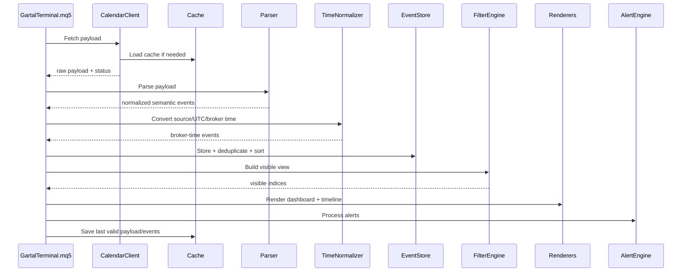

# 03 — Data Pipeline & Source Strategy

## Goal

Build a source pipeline that can start with Forex Factory direct fetching but remain replaceable if the site markup changes or distribution requirements demand an API bridge.

## Source Priority

The architecture supports three source modes:

| Mode | Name | Purpose |
|---:|---|---|
| 1 | Sample Data | Compile, UI, timeline, and alert testing without network. |
| 2 | Forex Factory Direct | Direct `WebRequest` to the configured calendar URL. |
| 3 | API Bridge / Mirror | Future JSON bridge if direct HTML parsing becomes unstable or legally/commercially unsuitable. |

## Pipeline



## Data Shape Stages

### Stage 1 — Raw Payload

Source-specific text.

Examples:

- HTML page;
- compact JSON from bridge;
- sample CSV/string.

The raw payload must never reach dashboard, timeline, or alerts.

### Stage 2 — Parsed Event

A source-aware parser extracts:

- source date/time;
- currency;
- impact;
- title;
- actual;
- forecast;
- previous;
- flags.

### Stage 3 — Normalized Event

The event becomes source-independent:

- stable `event_id`;
- canonical impact enum;
- `time_utc`;
- `time_broker`;
- semantic flags.

### Stage 4 — Visible Event View

The filter engine outputs visible event indices, not a duplicated event list.

## Fetch Cadence

Default refresh model:

| Condition | Refresh |
|---|---:|
| Market open, dashboard visible | every 60 seconds |
| High-impact event within 30 minutes | every 30 seconds |
| High-impact event within 5 minutes | every 15 seconds |
| Source error | exponential retry: 60s, 120s, 300s |
| Sample mode | no network refresh |

## Date Range Model

Default:

```text
days_back = 0
days_forward = 0
```

Meaning: today only.

User-configurable:

```text
days_back: 0..7
days_forward: 0..14
```

The first sellable version should support today and tomorrow cleanly before attempting full-week rendering.

## Source URL Builder

The source client must build URLs from config:

```text
source_base_url
source_day_mode
source_date
source_timezone_hint
```

Do not hard-code the URL inside parser code.

## Payload Identity

Every fetch should compute a lightweight payload hash:

```text
HASH(raw_payload)
```

If hash did not change, parsing can be skipped unless a time-sensitive actual-value update is expected.

## Sudden / Breaking News Handling

Breaking political remarks or sudden red-impact items are source-dependent.

The architecture supports them with flags:

```cpp
bool is_breaking;
bool is_speech;
bool is_tentative;
```

The parser must map source-specific labels into these flags when available.

If the source does not expose these items, the product should show a clear diagnostic instead of pretending it has unseen data.

## Commercial Risk Note

Direct HTML parsing is technically possible but fragile. The product architecture therefore treats Forex Factory as an adapter, not as the product core.

If direct HTML becomes unstable, the future bridge can output the same canonical event fields and the UI/alerts remain unchanged.
