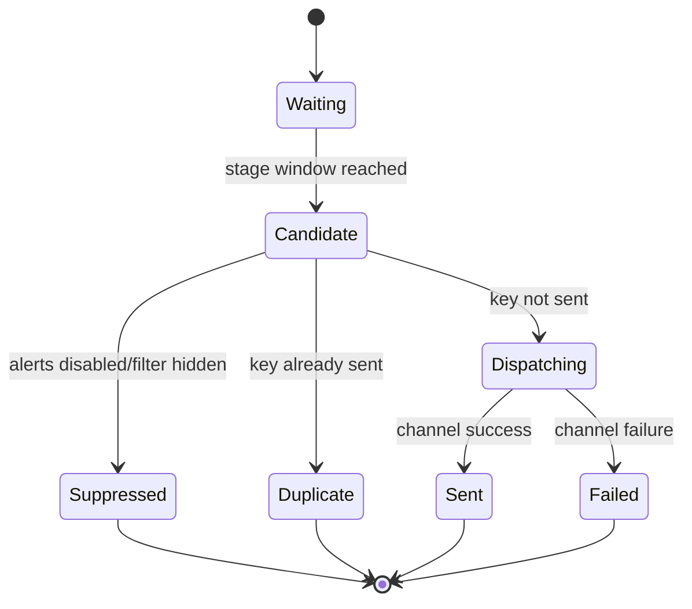

# 07 — Alert State Machine

## Goal

Alerts must be powerful but controlled.

The user should be able to enable alert channels and stages easily from dashboard or inputs, while the engine guarantees no duplicate spam.

## Alert Dimensions

### Stages

| Stage | Meaning |
|---|---|
| 60m | 60 minutes before event |
| 30m | 30 minutes before event |
| 15m | 15 minutes before event |
| 5m | 5 minutes before event |
| 1m | 1 minute before event |
| Release | at event time |
| ActualUpdate | when actual value appears/changes |

### Channels

| Channel | MT5 Mechanism |
|---|---|
| Popup | `Alert()` |
| Sound | `PlaySound()` |
| Push | `SendNotification()` |
| Email | `SendMail()` |
| Dashboard Badge | render-only status |

## Alert Eligibility

An event becomes an alert candidate when:

```text
event is visible
AND alerts are enabled
AND event impact/stage/channel is enabled
AND event time is within stage window
AND alert key was not sent before
```

## Idempotency Key

Every alert must have a unique key:

```text
{event.id}|{stage}|{channel}
```

Examples:

```text
GT-20260709-1530-USD-HIGH-NFPHASH|15M|POPUP
GT-20260709-1700-USD-HIGH-FEDCHAIRSPEAKS|RELEASE|PUSH
```

## State Machine



## Stage Window Logic

A stage should fire when:

```text
remaining_seconds <= stage_seconds
AND remaining_seconds > previous_stage_seconds_lower_bound
```

Simpler V1:

```text
if remaining_seconds <= stage_seconds and key not sent -> fire
```

Because idempotency prevents duplicate firing.

## Actual Update Alert

Actual update stage is special.

It fires when:

```text
event.actual was empty or old value
AND new payload contains actual value
AND actual value fingerprint changed
```

Required key:

```text
{event.id}|ACTUAL|{actual_hash}|{channel}
```

## Dashboard Alert Controls

Buttons:

```text
GT_DASH_BTN_ALERT_MASTER
GT_DASH_BTN_ALERT_POPUP
GT_DASH_BTN_ALERT_SOUND
GT_DASH_BTN_ALERT_PUSH
GT_DASH_BTN_ALERT_EMAIL
```

Optional stage toggles:

```text
GT_DASH_BTN_ALERT_60M
GT_DASH_BTN_ALERT_30M
GT_DASH_BTN_ALERT_15M
GT_DASH_BTN_ALERT_5M
GT_DASH_BTN_ALERT_1M
GT_DASH_BTN_ALERT_RELEASE
GT_DASH_BTN_ALERT_ACTUAL
```

## Alert Message Format

```text
gartal terminal | HIGH USD | 15m
15:30 broker | Non-Farm Employment Change
Forecast: 180K | Previous: 175K
```

Breaking/speech example:

```text
gartal terminal | BREAKING HIGH USD
17:00 broker | Trump remarks / political speech
```

## Persistence

V1 can keep alert state in memory.

V2 should persist sent keys to a lightweight cache file for terminal reload protection.

## Failure Modes

| Failure | Required Behavior |
|---|---|
| Duplicate alerts every timer tick | enforce idempotency key |
| Push/email not configured | show dashboard diagnostic, do not crash |
| Event time shifts after source refresh | new event ID or time-hash should determine whether alert state remains valid |
| User disables alerts | no future alert dispatch, dashboard badge updates |

## Acceptance Gate

Alert architecture is accepted when:

- every enabled stage fires once per event/channel;
- disabling alerts from dashboard stops dispatch immediately;
- hidden events do not alert unless a future setting allows global alerts;
- release-time alerts do not repeat;
- actual update alerts fire only on changed actual value.
