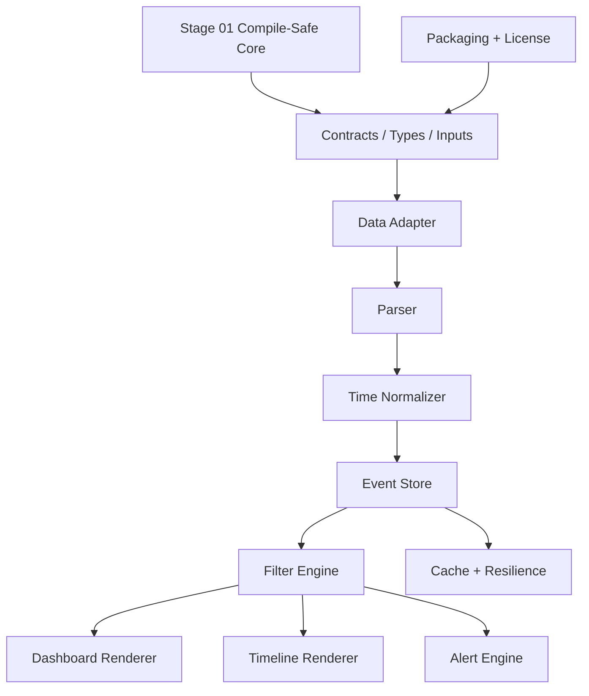

# Implementation Index — gartal terminal

## Active coding stages

- [[stage_01_compile_safe_core_skeleton|Stage 01 — Compile-Safe Core Skeleton]]
- [[stage_01/00_STAGE_01_INDEX|Stage 01 Detailed Index]]

## Core Notes

- [[../05_implementation_master_plan|Implementation Master Plan]]
- [[01_foundation_and_contracts|01 — Foundation & Contracts]]
- [[02_data_acquisition_forex_factory_adapter|02 — Data Acquisition & Forex Factory Adapter]]
- [[03_time_normalization_and_broker_gmt|03 — Time Normalization & Broker GMT]]
- [[04_event_model_filter_engine|04 — Event Model & Filter Engine]]
- [[05_dashboard_ui_implementation|05 — Dashboard UI Implementation]]
- [[06_chart_timeline_renderer|06 — Chart Timeline Renderer]]
- [[07_alert_engine_implementation|07 — Alert Engine Implementation]]
- [[08_cache_resilience_and_failover|08 — Cache, Resilience & Failover]]
- [[09_packaging_licensing_distribution|09 — Packaging, Licensing & Distribution]]
- [[10_validation_qa_release_gate|10 — Validation, QA & Release Gate]]
- [[11_next_build_sprints|11 — Next Build Sprints]]
- [[../gartal_terminal_implementation_architecture.canvas|Implementation Canvas]]
- [[../gartal_terminal_stage_01.canvas|Stage 01 Canvas]]

## Engineering Layers

## Current Product Assumptions

- Platform: MT5 / MQL5.
- Product name: `gartal terminal`.
- Default date range: today only.
- Data model: Forex Factory-style economic calendar by currency.
- No synthetic XAU/XAG/OIL calendar in v1; gold traders use USD/high-impact filters.
- Breaking/speech events must be treated as high-priority red events when the source provides them or when manually injected by future source adapters.
- Dashboard filters must be changeable from the chart UI, not only from indicator inputs.
- Broker GMT must support manual input and auto-detection diagnostics.

## Definition of Beta

A beta build is acceptable when:

- sample event mode compiles and renders correctly
- Forex Factory adapter is isolated and replaceable
- dashboard filtering works from UI controls
- forward chart timeline draws events until the end of the selected range
- alert stages are deduplicated
- cache fallback works after network failure
- release package can be generated with one PowerShell command
