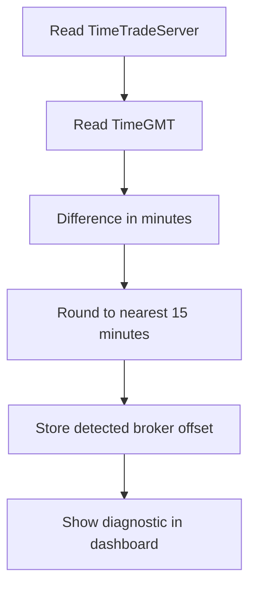

# Phase 03 — Time Normalization & Broker GMT

## Objective

Guarantee that every event is displayed at the correct chart time. This is the most important correctness layer because a premium news terminal fails immediately if news lines are shifted by one hour.

## Time Model

The system should store multiple time fields, not one ambiguous timestamp.

| Field | Meaning |
|---|---|
| `source_time` | time as interpreted from the source payload |
| `utc_time` | canonical normalized UTC timestamp |
| `broker_time` | timestamp rendered on MT5 chart |
| `display_time` | formatted label shown in dashboard |

## Broker GMT Strategy

Two modes are required:

1. **Manual mode:** user sets broker GMT offset in inputs.
2. **Auto-diagnostic mode:** indicator compares server time with GMT and estimates offset.

Manual mode must always override auto-detection.

## Implementation Tasks

- [ ] Add `InpBrokerGMTOffsetHours` and `InpBrokerGMTOffsetMinutes`.
- [ ] Add `InpAutoDetectBrokerGMT`.
- [ ] Add `DetectBrokerOffsetMinutes()`.
- [ ] Add `NormalizeEventTimeToUTC()`.
- [ ] Add `ConvertUTCToBrokerTime()`.
- [ ] Add dashboard line: `Broker GMT: Auto +02:00` or `Broker GMT: Manual +03:00`.
- [ ] Add warning state when auto-detection result differs from manual input.
- [ ] Add date-range normalization: today, tomorrow, this week, custom days back/forward.

## Auto-Detection Logic

## Date Range Defaults

| Setting | Default |
|---|---:|
| Days Back | 0 |
| Days Forward | 0 |
| Include Today | true |
| End-of-day boundary | broker day by default |

## Important Edge Cases

- Sunday/Monday rollover.
- Broker DST changes.
- News source time zone mismatch.
- Events marked as `All Day` or tentative.
- Events with no precise minute.
- Source event date differs from broker date near midnight.

## Acceptance Criteria

- Event line appears at correct broker chart time when manual GMT is set.
- Auto-detected offset is visible and debuggable.
- User can disable auto mode and force a fixed GMT.
- Events near midnight are not silently dropped.
- Dashboard and chart line use the same `broker_time` field.

## Failure Modes

| Failure | Control |
|---|---|
| Broker server uses DST | manual override and dashboard warning |
| Source is not UTC | source adapter must declare source timezone assumption |
| Tentative event has no time | render in dashboard, avoid precise chart line unless mapped |

## Next

- [[04_event_model_filter_engine|Phase 04 — Event Model & Filter Engine]]
