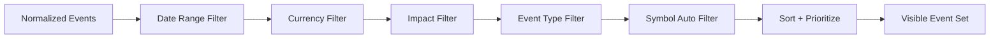

# Phase 04 — Event Model & Filter Engine

## Objective

Build one canonical filter pipeline that controls dashboard rows, chart event lines, bottom timeline labels, and alerts. No visual module should apply its own independent filter rules.

## Canonical Pipeline

## Currency Filter

Required currencies:

- USD
- EUR
- GBP
- JPY
- CHF
- CAD
- AUD
- NZD
- CNY

The product must not pretend that gold has its own economic calendar. For XAUUSD charts, the default symbol auto-filter should prioritize USD high-impact events.

## Impact Filter

| Impact | Default | Visual |
|---|---:|---|
| High | on | red / premium danger glow |
| Medium | on | orange |
| Low | off | yellow / dim |
| Holiday | off | gray |
| Speech | on | red if high-impact; purple/blue if lower priority |
| Tentative | on | dashed / clock marker |
| Breaking | on | red / urgent |

## Dashboard Filter Requirement

Every major filter must be toggleable from the dashboard UI:

- currencies
- impact levels
- speeches
- holidays
- tentative events
- breaking events
- date range preset
- alert master switch
- compact/full dashboard mode

## Implementation Tasks

- [ ] Build `PassesCurrencyFilter(event, config)`.
- [ ] Build `PassesImpactFilter(event, config)`.
- [ ] Build `PassesEventTypeFilter(event, config)`.
- [ ] Build `PassesDateRangeFilter(event, config)`.
- [ ] Build `ApplySymbolAutoFilter(event, symbol, config)`.
- [ ] Build `BuildVisibleEventSet()` as the only exported filter output.
- [ ] Sort visible events by `broker_time` ascending.
- [ ] Add next-event selector.
- [ ] Add high-priority selector for alert engine.

## Symbol Auto-Filter

| Chart Symbol | Default Event Focus |
|---|---|
| EURUSD | EUR + USD |
| GBPUSD | GBP + USD |
| USDJPY | USD + JPY |
| XAUUSD | USD high/medium + breaking/speeches |
| US30/NAS100/SPX | USD high/medium + breaking/speeches |
| Unknown symbol | manual currency selection only |

## Acceptance Criteria

- Dashboard, timeline, and alerts use the same visible event set.
- User can override symbol auto-filter.
- High-impact USD events appear on XAUUSD by default.
- Low-impact events are hidden by default but can be enabled.
- Breaking events always remain visible when `Show Breaking` is enabled.

## Failure Modes

| Failure | Control |
|---|---|
| Different modules show different event counts | enforce single `BuildVisibleEventSet()` |
| XAU traders see no news | XAUUSD maps to USD macro events |
| Event type conflict | priority order: breaking > speech > holiday > impact |

## Next

- [[05_dashboard_ui_implementation|Phase 05 — Dashboard UI Implementation]]
