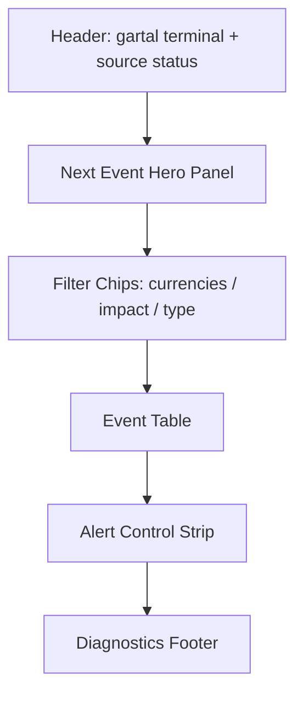
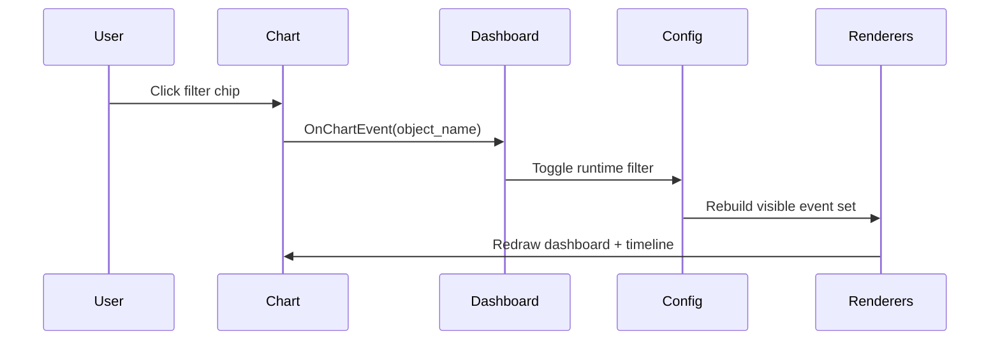

# Phase 05 — Dashboard UI Implementation

## Objective

Build the premium on-chart control center for `gartal terminal`: a luxury dashboard that shows upcoming news, source status, broker GMT state, filters, and alert controls without forcing the user to reopen indicator inputs.

## UI Principles

1. **Terminal-grade:** looks like a serious macro desk widget, not a basic MT5 table.
2. **Low cognitive load:** next high-impact event must be visible in under one second.
3. **Filter-first:** user can change currencies and impact levels directly from dashboard controls.
4. **Chart-safe:** dashboard must not hide price action unless the user chooses a large mode.
5. **Stateful:** toggles must update runtime config immediately.

## Dashboard Zones

## Required UI Components

| Component | Description |
|---|---|
| Header | product name, source status, last update, broker GMT |
| Next Event Hero | nearest high/medium visible event with countdown |
| Currency Chips | USD/EUR/GBP/JPY/CHF/CAD/AUD/NZD/CNY toggles |
| Impact Chips | High/Medium/Low/Holiday/Speech/Tentative/Breaking toggles |
| Event Table | time, currency, impact, title, actual, forecast, previous, countdown |
| Alert Strip | master alert, sound, push, email, pre-release stages |
| Footer | WebRequest status, cache status, event count, mode |

## Visual Language

| State | Visual Treatment |
|---|---|
| High impact | red accent, stronger border, optional glow |
| Medium impact | amber/orange accent |
| Low impact | dim yellow accent |
| Breaking | red urgent badge |
| Speech | microphone badge or `SP` tag |
| Tentative | dashed icon or `TENT` tag |
| Released | dimmed row |
| Next event | highlighted hero state |

## Implementation Tasks

- [ ] Build object prefix naming system: `GT_DASH_`.
- [ ] Build dashboard background panel.
- [ ] Build header labels.
- [ ] Build source-status label.
- [ ] Build broker GMT diagnostic label.
- [ ] Build next-event hero card.
- [ ] Build filter chips as clickable MT5 button objects.
- [ ] Build event table rows with capped row count.
- [ ] Build row object pooling to avoid object churn.
- [ ] Build alert toggle strip.
- [ ] Add compact/full mode.
- [ ] Add anchor/corner inputs.
- [ ] Add layout scaling input.
- [ ] Add redraw throttling.

## Dashboard Interaction Model

MT5 chart events should be used to detect object clicks.

## Acceptance Criteria

- User can toggle currencies from dashboard.
- User can toggle impact filters from dashboard.
- Dashboard updates without reloading indicator.
- UI does not flicker under normal tick updates.
- Event table remains readable with at least 20 events.
- Source failure is visible, not silent.

## Failure Modes

| Failure | Control |
|---|---|
| Too many chart objects slow MT5 | object pooling + row cap + redraw throttle |
| Filter chips desync from inputs | runtime config is the only live source |
| UI overlaps price | anchor/corner and compact mode |
| Alerts toggled but not reflected | alert strip reads same runtime config |

## Next

- [[06_chart_timeline_renderer|Phase 06 — Chart Timeline Renderer]]
