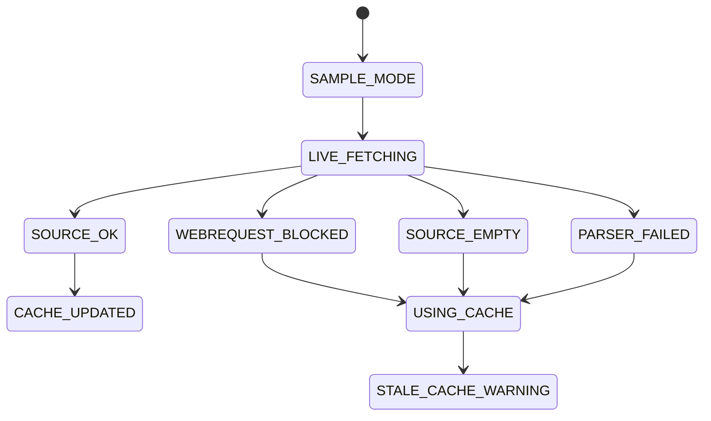

# Phase 08 — Cache, Resilience & Failover

## Objective

Make the indicator commercially reliable when network access fails, Forex Factory changes markup, WebRequest is blocked, or the source returns empty data.

## Resilience Doctrine

A professional news terminal must fail visibly and gracefully. It must never silently display stale data as if it were live.

## Cache Layers

| Layer | Purpose |
|---|---|
| In-memory event store | fast UI/timeline redraw |
| Local raw payload cache | fallback if source is temporarily unavailable |
| Normalized event cache | future optimization |
| Parser fixtures | regression tests for source changes |

## Source State Machine

## Implementation Tasks

- [ ] Add cache path config under `MQL5/Files/gartal_terminal/`.
- [ ] Save raw payload after successful fetch.
- [ ] Load raw payload when live fetch fails.
- [ ] Mark cached data with timestamp and age.
- [ ] Add dashboard cache badge.
- [ ] Add stale-cache threshold input.
- [ ] Add manual refresh button.
- [ ] Add parser failure diagnostics.
- [ ] Add fixture payloads for high-impact days.
- [ ] Add no-data state UI.

## User-Facing Failure Messages

| Failure | Dashboard Message |
|---|---|
| WebRequest blocked | `Allow URL in MT5 WebRequest settings` |
| Parser failed | `Calendar format changed or source unreadable` |
| Cache used | `Using cached data from HH:MM` |
| Cache stale | `Cache stale — verify calendar manually` |
| No events | `No visible events under current filters` |

## Acceptance Criteria

- Indicator still opens without internet.
- Dashboard clearly distinguishes live vs cached vs sample data.
- Cached data age is visible.
- Parser failure does not crash UI.
- User can manually refresh data.

## Failure Modes

| Failure | Control |
|---|---|
| Stale data mistaken as live | explicit cache age badge |
| Cache corrupt | fallback to sample/no-data state |
| Repeated fetch failure slows chart | fetch interval and cooldown |
| Parser change breaks release | parser fixtures and regression checklist |

## Next

- [[09_packaging_licensing_distribution|Phase 09 — Packaging, Licensing & Distribution]]
