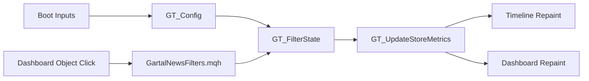

# Stage 06 — Runtime Filter Engine

[[00_STAGE_06_INDEX]]

## Mission

Make `gartal terminal` feel like a real terminal instead of a passive indicator. The trader must be able to click the dashboard and immediately control what the chart is showing without opening MT5 inputs.

## Core Design

## What Changed

- Added `GartalNewsFilters.mqh`.
- Added live dashboard filter buttons.
- Added currency chip controls.
- Added utility presets.
- Added runtime filter diagnostics.
- Updated `OnChartEvent()` to refresh metrics and repaint after clicks.
- Updated dashboard height model for expanded filter rows.

## Product Behavior

When the user clicks `RED OFF`, all high-impact news disappears from:

- table rows;
- mini tape;
- next event card if it was the next filtered event;
- next red card;
- chart vertical lines;
- bottom labels;
- danger zones.

When the user clicks `USD`, USD events are toggled out/in from the current dashboard session.

When the user clicks `RESET`, runtime filters return to MT5 input defaults.

## Engineering Rules

1. `GT_Config` is the boot preset only.
2. `GT_FilterState` is the runtime state.
3. The event store is not mutated by UI clicks.
4. Store metrics are recalculated after every click.
5. Timeline and dashboard are repainted from the same filter state.

## Stage 06 Acceptance Criteria

- Clicking impact buttons changes visible events.
- Clicking currency buttons changes visible currencies.
- Clicking special buttons changes speech/breaking/tentative/past/symbol filters.
- Utility presets work.
- Reset restores input defaults.
- Dashboard and timeline remain synchronized.
- No stale objects remain from previous filter states.

## Next Stage

[[../stage_07_alert_engine_state_machine]]

Stage 07 must wire alert firing to the same runtime filters.
